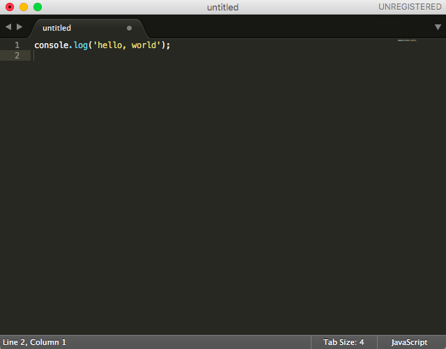
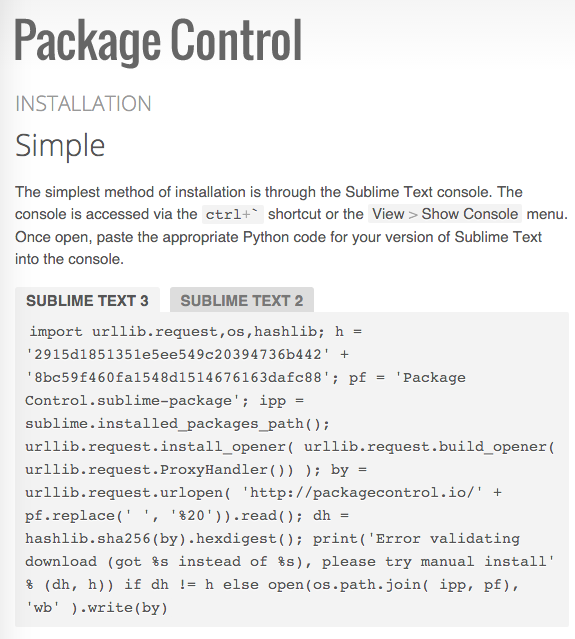
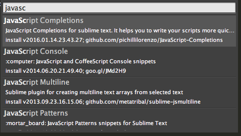

```
title: 在 Sublime Text 上配置 ES2015 开发环境
date: 2016-03-08
author: 老雷
```

## 安装

首先访问 Sublime Text 的官网 https://www.sublimetext.com/3 下载对应系统版本的安装包：


安装提示安装完毕之后，启动 Sublime Text ，其界面如下：



其中右下角的 **「Tab Size: 4」** 表示当前缩进的长度，默认为 4 个空格。大多数的 JavaScript 编程风格都是使用 2 个空格长度的，点击该处可以在弹出的菜单中选择长度，并勾选 **「Indent Using Spaces」** 来使用空格代替 Tab 缩进，这样就能保证在不同平台下显示一致。

## 配置

Sublime Text 的配置通过改配置文件来完成，选择菜单 **Preferences > Settings - User**（OSX 系统下是 **Sublime Text > Preferences > Settings - User**） 即可打开配置文件，然后在打开默认的配置文件 **Preferences > Settings - Default** 作为对照，把需要更改的项目复制到「User」配置文件并修改其值。

比如以下配置用来修改缩进长度和方式：

```javascript
{

  // The number of spaces a tab is considered equal to
  "tab_size": 2,

  // Set to true to insert spaces when tab is pressed
  "translate_tabs_to_spaces": true,

}
```

详细使用方法可参考本章末尾的「相关链接」。

## 安装 Package Control

使用 Sublime Text 的一大乐趣就是可以为其安装各种各样的插件，但是 Sublime Text 并没有内置插件管理器，我们需要自己去安装。

首先打开 Sublime Text 的包管理器安装页面 https://packagecontrol.io/installation



由于上文中我们安装的是 Sublime Text 3，所以先复制页面中 **SUBLIME TEXT 3** 下面对应的代码，然后转到 Sublime Text 窗口，选择菜单 **View > Show Console**，这时编辑器窗口下面会显示一个新的窗口，在输入栏中粘贴刚才复制的代码，并按回车执行，稍等片刻即可安装完成（主要取决于当前网络环境）。

安装完 Package Control 之后，我们就可以随心所欲地安装需要的插件了。下面我们来介绍 Package Control 的一些基本命令：

+ **Install Package** - 安装插件
+ **Remove Package** - 删除插件
+ **Enable Package** - 启用插件
+ **Disable Package** - 禁用插件

一般常用的就是 **Install Package** 和 **Remove Package**，要执行以上命令可以在 Sublime Text 界面下按 **Ctrl + Shift + P** 键（在 OSX 系统下是 **Command + Shift + P**），这时会弹出一个下面这样的窗口：


在窗口中输入命令 **Install Package** 并按回车，稍等几秒，便会弹出以下窗口：



可以直接在输入框中输入插件名称来搜索插件，并通过方向键来选择要安装的插件，按回车即可安装。


## 常用的 Sublime Text 插件

### JavaScriptNext - ES6 Syntax

默认情况下 Sublime Text 并不支持高亮显示 ES6 语法，由于本书的示例代码主要使用 ES6 来编写，因此需要先安装此插件。

安装完此插件之后，需要执行以下操作将其设置为 `*.js` 文件默认的样式：

+ 打开一个 `.js` 后缀的 JavaScript 文件
+ 选择菜单 **View > Syntax > Open all with current extension as... > JavascriptNext - ES6 Syntax > JavascriptNext**。具体使用方法可访问插件的主页查看。

项目主页：https://github.com/Benvie/JavaScriptNext.tmLanguage

### Git​Gutter

如果当前编辑的文件是在一个 Git 项目下面的，安装了 GitGutter 之后可以直接在编辑器中查看到当前文件的改动情况，比如：


项目主页：https://github.com/jisaacks/GitGutter

### SublimeLinter

SublimeLinter 主要用于在 Sublime Text 下对代码进行语法检查，这个插件安装配置会稍微复杂一些。

首先执行以下命令安装用于 JavaScript 语法检查的 eslint 和 babel-eslint ：

```bash
$ npm install -g eslint babel-eslint
```

由于 babel-eslint 依赖的模块比较多，在国内的网络环境下可能会安装失败，可以在安装时指定使用淘宝的 NPM 镜像：

```bash
$ npm install -g eslint babel-eslint --registry=http://registry.npm.taobao.org
```

安装完成后，我们再通过 Package Control 来安装 SublimeLinter 和 SublimeLinter-contrib-eslint 这两个插件。

现在我们来打开一个 JavaScript 文件：


如上图所示，由于 `hello world` 这一行有语法错误，该行前面会有一个红色的圆圈，并且编辑器底部会显示具体的出错信息**「Error: Parsing error: Unexpeced token, line 5, Column 9」**

要让 SublimeLinter 支持其他编程语言，可以搜索 `SublimeLinter-` 开头的插件并安装。

项目主页：http://www.sublimelinter.com/

## 相关链接

+ [推荐！Sublime Text 最佳插件列表](http://blog.jobbole.com/79326/)
+ [Sublime Text 3能用支持的插件推荐](http://dengo.org/archives/923)
+ [Gif多图：我常用的 16 个 Sublime Text 快捷键](http://blog.jobbole.com/82527/)
+ [Sublime Text 3 文档](http://tutorial.jingwentian.com/Sublime-Text-3-Documentation/index.html)
+ [Sublime Text 3 配置和使用方法](https://www.zybuluo.com/king/note/47271)
